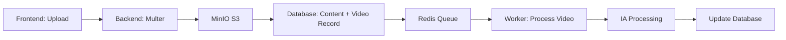
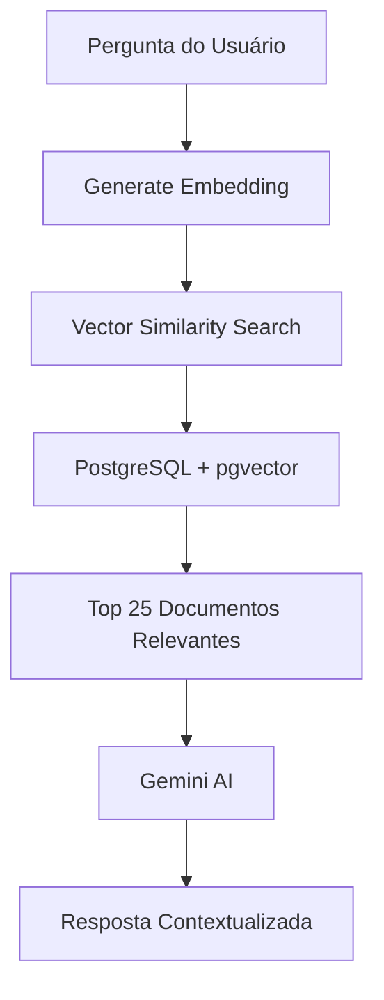
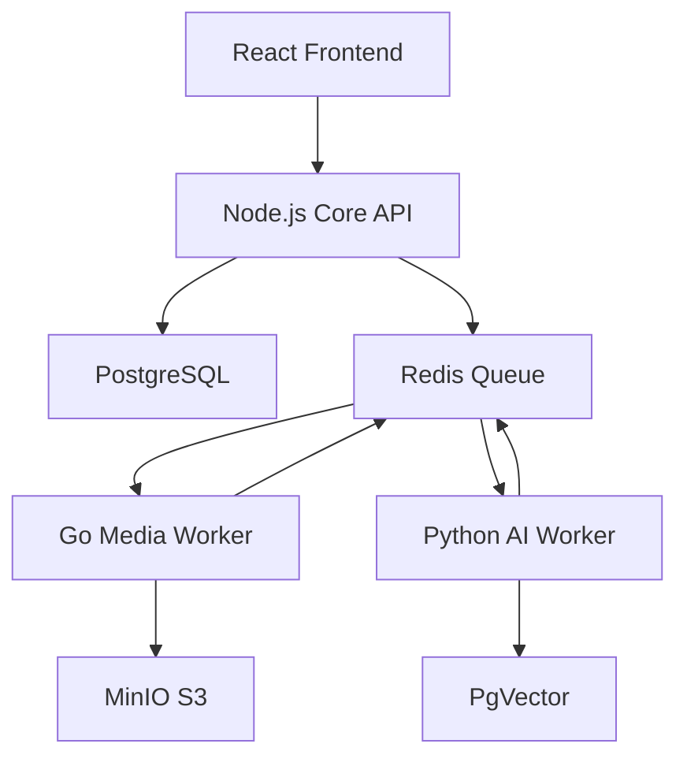

# Documentação Técnica Completa - EdWise AI

## 📋 Sumário Executivo

**EdWise** é uma plataforma LMS (Learning Management System) completa powered by AI, desenvolvida para facilitar o ensino e aprendizagem através de conteúdo de vídeo enriquecido com Inteligência Artificial. A plataforma utiliza tecnologias avançadas de RAG (Retrieval-Augmented Generation), processamento de vídeo com IA, armazenamento em nuvem S3, e chat assistente inteligente.

---

## 🏗️ Arquitetura do Sistema

### Stack Tecnológico

#### Frontend
- **Framework**: React 18 com Vite
- **Styling**: TailwindCSS
- **Linguagem**: TypeScript
- **Ícones**: Lucide React
- **Gerenciamento de Estado**: Context API

#### Backend
- **Runtime**: Node.js (Express)
- **Linguagem**: JavaScript (ES Modules)
- **Banco de Dados**: PostgreSQL 15
- **ORM**: Queries SQL nativas
- **Cache & Filas**: Redis (Bull)

#### AI & Machine Learning
- **LLM**: Google Gemini 2.0 Flash
- **Embeddings**: Gemini Embedding 001 (1536 dimensões)
- **Transcrição**: OpenAI Whisper (modelo medium, local)
- **Vector Database**: PostgreSQL com pgvector

#### Infraestrutura
- **Containerização**: Docker & Docker Compose
- **Storage**: MinIO (S3-compatible)
- **Reverse Proxy**: Traefik (configurável)
- **Processamento de Vídeo**: FFmpeg

---

## 🎯 Funcionalidades Principais

### 1. Sistema de Gerenciamento de Cursos

#### 1.1 Criação e Organização de Cursos
- **Cursos**: Professores podem criar cursos com título, descrição e tipo de organização
- **Módulos**: Estrutura hierárquica com suporte a módulos aninhados (pastas)
- **Conteúdos**: Diversos tipos de materiais de aprendizagem

**Tipos de Organização:**
- `custom`: Organização personalizada pelo professor
- `linear`: Progressão linear através dos módulos

#### 1.2 Tipos de Conteúdo Suportados
- ✅ **Vídeos**: Upload com processamento automático de IA
- ✅ **PDFs**: Materiais de leitura
- ✅ **Textos**: Artigos e guias nativos
- ✅ **Links**: Recursos externos
- ✅ **Documentos Word**: Materiais complementares
- ✅ **Quizzes**: Avaliações interativas

#### 1.3 Gestão de Usuários
**3 Níveis de Permissão:**
- **Admin**: Acesso total ao sistema
- **Professor**: Criar/editar cursos, módulos e conteúdos
- **Student**: Visualizar e consumir conteúdos matriculados

---

### 2. Upload e Processamento de Vídeos com IA

#### 2.1 Fluxo de Upload de Vídeos

**Pipeline de Processamento:**



**Etapas Detalhadas:**

1. **Upload Inicial**
   - Professor faz upload via interface web
   - Backend recebe arquivo via Multer (armazenamento temporário)
   - Gera UUID único para o arquivo
   - Upload para MinIO S3 com chave `videos/{uuid}-{filename}`

2. **Criação de Registros**
   - Criação de registro `contents` (status: não publicado)
   - Criação de registro `videos` (status: `processing`)
   - Cleanup do arquivo temporário local

3. **Enfileiramento para Processamento**
   - Job adicionado à fila Redis `video-queue`
   - Processamento assíncrono via BullMQ

#### 2.2 Processamento de Vídeo com IA

**Worker de Processamento (`worker.js`):**

O worker consome jobs da fila e executa:

```javascript
{
  videoId: number,
  s3Key: string,
  filename: string,
  contentId: number
}
```

**Serviço de Processamento (`videoAI.js`):**

##### Etapa 1: Download do S3
```javascript
await downloadVideoFromS3(s3_key)
// Baixa vídeo do MinIO para processamento local
```

##### Etapa 2: Extração de Legendas/Transcrição
- **Primeira Tentativa**: Extração de SRT embutido (FFmpeg)
- **Fallback**: Transcrição com Whisper AI (local)

```javascript
// Extrai áudio MP3
ffmpeg(videoPath)
  .output(audioPath)
  .audioCodec('libmp3lame')
  .run()

// Transcreve com Whisper
transcribeWithWhisper(audioPath)
```

**Modelo Whisper Usado:** `medium` (balance entre qualidade e velocidade)

##### Etapa 3: Parsing de Transcrição
- Parse do SRT em estrutura de dados organizada por minutos
- Facilita busca temporal e geração de FAQs

```javascript
{
  0: [{ time: "00:00:01", text: "..." }],
  1: [{ time: "00:01:15", text: "..." }],
  ...
}
```

##### Etapa 4: Geração de Resumo (Gemini AI)

**Prompt System:**
```
Você é um resumidor de vídeo educacional experiente. 
Sua função é criar um resumo do vídeo e listar todas as ferramentas 
utilizadas indicando em qual tempo ela foi mencionada.
```

**Output Format (Markdown):**
```markdown
# Título do vídeo

## Resumo
[Resumo detalhado com principais tópicos, ferramentas e passo a passo]

## Ferramentas
- **Ferramenta 1** (t=2m47s): Descrição e uso
- **Ferramenta 2** (t=5m30s): Descrição e uso
```

##### Etapa 5: Geração de FAQs Contextuais

**Estratégia de Batching:**
- Processamento em lotes de 3 minutos de vídeo
- Reduz chamadas à API e melhora contexto local

**Prompt System:**
```
Analise o texto em <SRT> tendo em consideração <RESUMO_VIDEO> 
e <TITULO_VIDEO>, crie várias perguntas baseado em como o aluno 
iria perguntar. Indique em qual minuto e segundo do vídeo estará 
a resposta usando formato &t do YouTube.
```

**Output (JSON):**
```json
[
  {
    "pergunta": "Como configurar o Whisper?",
    "tempo": "t=15m10s"
  }
]
```

##### Etapa 6: Geração e Armazenamento de Embeddings

**Para cada FAQ gerada:**

1. **Construção do Documento:**
```javascript
const docContent = `No vídeo ${titulo}. ${faq.pergunta} tempo: ${faq.tempo}`;
```

2. **Geração de Embedding:**
```javascript
// Gemini Embedding 001 - 1536 dimensões
const embedding = await generateEmbedding(docContent);
```

3. **Metadados Armazenados:**
```javascript
{
  video_url: "https://s3.tgbia.com/edwise/videos/...",
  video_id: 123,
  content_id: 456,
  course_id: 789,
  title: "Título do Vídeo",
  tempo: "t=15m10s"
}
```

4. **Inserção no PostgreSQL:**
```sql
INSERT INTO documents (content, metadata, embedding) 
VALUES ($1, $2, $3::vector)
```

**Logs de Progresso:**
```
🎥 STARTING AI PROCESSING FOR VIDEO ID: 123
📋 [1/6] Fetching video metadata...
📥 [2/6] Downloading video from S3...
🎙️ [3/6] Extracting subtitles/transcription...
📝 [4/6] Parsing transcript...
🤖 [5/6] Generating AI summary...
❓ [6/6] Generating FAQs...
🧠 [7/7] Generating and storing embeddings...
✅ VIDEO PROCESSING COMPLETED
```

##### Etapa 7: Atualização de Status
```sql
UPDATE videos 
SET transcription = $1, 
    summary = $2, 
    metadata = jsonb_set(metadata, '{faq}', $3::jsonb),
    status = 'ready',
    updated_at = NOW()
WHERE id = $4
```

---

### 3. Sistema RAG (Retrieval-Augmented Generation)

#### 3.1 Arquitetura RAG

**Fluxo de Busca Semântica:**



#### 3.2 Busca Vetorial (ragService.js)

**Algoritmo de Similaridade:**
- **Operador**: `<=>` (cosine similarity do pgvector)
- **Top K**: 25 documentos mais relevantes
- **Filtros**: Suporta filtro por `course_id`

```javascript
async function searchDocuments(query, topK = 25, filter = {}) {
  // 1. Gera embedding da query
  const queryEmbedding = await generateEmbedding(query);
  
  // 2. Busca vetorial
  const sql = `
    SELECT 
      id, content, metadata,
      (embedding <=> $1::vector) AS distance
    FROM documents
    WHERE metadata @> $3
    ORDER BY distance ASC 
    LIMIT $2
  `;
  
  return await db.query(sql, [
    `[${queryEmbedding.join(',')}]`, 
    topK, 
    JSON.stringify(filter)
  ]);
}
```

#### 3.3 Chat Assistente Inteligente (geminiAgent.js)

**Sistema de Prompts:**

```javascript
const SYSTEM_PROMPT = `
# Quem você é:
Assistente de IA da EdWise, comunidade focada em Agentes de IA.

# Sua função:
Usar o sistema RAG para localizar respostas nos vídeos e responder 
com a resposta + link do YouTube agregando &t=<tempo> no final.

# Guidelines:
- Máximo 2 links relevantes
- Resposta simples, objetiva e curta (máx 300 caracteres)
- Sempre forneça link da aula com timestamp correto (t=7m50s)
- Sem markdown excessivo
`;
```

**Pipeline de Resposta:**

1. **Busca de Contexto:**
```javascript
// Busca documentos relevantes via RAG
const relevantDocs = await searchDocuments(userMessage, 25, { 
  course_id: courseId 
});
```

2. **Enriquecimento com SRT:**
```javascript
// Extrai top 3 vídeos mais relevantes
const videoIds = new Set();
relevantDocs.slice(0, 3).forEach(doc => {
  videoIds.add(doc.metadata.video_id);
});

// Busca transcrição completa
for (const videoId of videoIds) {
  const videoData = await getVideoSRT(videoId);
  srtContext += `\n[SRT Completo - ${videoData.title}]\n${videoData.srt}\n`;
}
```

3. **Geração de Resposta:**
```javascript
const model = genAI.getGenerativeModel({
  model: 'gemini-2.0-flash-exp',
  systemInstruction: fullSystemPrompt
});

const result = await model.generateContent(userMessage);
return result.response.text();
```

**Exemplo de Resposta:**
```
Para configurar o Whisper localmente, você precisa instalar 
via pip e baixar o modelo. Veja aqui: 
https://youtube.com/watch?v=abc123&t=15m10s

Também tem um tutorial completo neste vídeo:
https://youtube.com/watch?v=def456&t=3m22s
```

---

### 4. Armazenamento de Vídeos no S3 (MinIO)

#### 4.1 Configuração MinIO

**MinIO como S3-Compatible Storage:**

```yaml
# docker-compose.yml
minio:
  image: minio/minio:latest
  environment:
    - MINIO_ROOT_USER=${MINIO_ACCESS_KEY}
    - MINIO_ROOT_PASSWORD=${MINIO_SECRET_KEY}
  volumes:
    - minio-data:/data
  ports:
    - "9000:9000"  # API
    - "9001:9001"  # Console
  command: server /data --console-address ":9001"
```

**Variáveis de Ambiente:**
```env
MINIO_SERVER_URL=https://s3.tgbia.com
MINIO_ACCESS_KEY=<access_key>
MINIO_SECRET_KEY=<secret_key>
MINIO_BUCKET=edwise
```

#### 4.2 Cliente S3 (AWS SDK v3)

```javascript
// server/services/minio.js
import { S3Client } from '@aws-sdk/client-s3';

const s3Client = new S3Client({
  endpoint: process.env.MINIO_SERVER_URL,
  region: 'us-east-1',
  credentials: {
    accessKeyId: process.env.MINIO_ACCESS_KEY,
    secretAccessKey: process.env.MINIO_SECRET_KEY,
  },
  forcePathStyle: true
});
```

#### 4.3 Operações S3

**Upload de Vídeo:**
```javascript
import { PutObjectCommand } from '@aws-sdk/client-s3';

const uploadParams = {
  Bucket: 'edwise',
  Key: `videos/${uuid}-${filename}`,
  Body: fileStream,
  ContentType: 'video/mp4',
};

await s3Client.send(new PutObjectCommand(uploadParams));
```

**Download de Vídeo:**
```javascript
import { GetObjectCommand } from '@aws-sdk/client-s3';

const command = new GetObjectCommand({
  Bucket: 'edwise',
  Key: s3Key,
});

const response = await s3Client.send(command);
return response.Body; // Stream
```

**Streaming para Cliente:**
```javascript
app.get('/api/videos/:id/stream', async (req, res) => {
  const response = await s3Client.send(command);
  res.setHeader('Content-Type', 'video/mp4');
  res.setHeader('Content-Length', response.ContentLength);
  response.Body.pipe(res);
});
```

**Deleção de Vídeo:**
```javascript
import { DeleteObjectCommand } from '@aws-sdk/client-s3';

await s3Client.send(new DeleteObjectCommand({ 
  Bucket: 'edwise', 
  Key: s3Key 
}));
```

#### 4.4 Estrutura de Arquivos no Bucket

```
edwise/
└── videos/
    ├── 550e8400-e29b-41d4-a716-446655440000-aula01.mp4
    ├── 6ba7b810-9dad-11d1-80b4-00c04fd430c8-introducao.mp4
    └── ...
```

---

### 5. Banco de Dados PostgreSQL

#### 5.1 Schema Completo

##### Tabela: `users`
```sql
CREATE TABLE users (
  id SERIAL PRIMARY KEY,
  name TEXT NOT NULL,
  email TEXT UNIQUE NOT NULL,
  password_hash TEXT NOT NULL,
  role TEXT NOT NULL CHECK (role IN ('admin', 'professor', 'student')),
  created_at TIMESTAMP DEFAULT NOW()
);
```

##### Tabela: `courses`
```sql
CREATE TABLE courses (
  id SERIAL PRIMARY KEY,
  title TEXT NOT NULL,
  description TEXT,
  professor_id INTEGER REFERENCES users(id),
  organization_type TEXT DEFAULT 'custom',
  created_at TIMESTAMP DEFAULT NOW()
);
```

##### Tabela: `modules`
```sql
CREATE TABLE modules (
  id SERIAL PRIMARY KEY,
  course_id INTEGER REFERENCES courses(id) ON DELETE CASCADE,
  title TEXT NOT NULL,
  parent_id INTEGER REFERENCES modules(id) ON DELETE CASCADE,
  order_index INTEGER DEFAULT 0,
  type TEXT DEFAULT 'folder',
  created_at TIMESTAMP DEFAULT NOW()
);
```

##### Tabela: `contents`
```sql
CREATE TABLE contents (
  id SERIAL PRIMARY KEY,
  module_id INTEGER REFERENCES modules(id) ON DELETE CASCADE,
  title TEXT NOT NULL,
  type TEXT NOT NULL CHECK (type IN ('pdf', 'video', 'text', 'link', 'word', 'quiz')),
  data JSONB DEFAULT '{}',
  description TEXT,
  settings JSONB DEFAULT '{}',
  is_published BOOLEAN DEFAULT false,
  release_at TIMESTAMP,
  release_after_days INTEGER,
  order_index INTEGER DEFAULT 0,
  created_at TIMESTAMP DEFAULT NOW()
);
```

##### Tabela: `videos`
```sql
CREATE TABLE videos (
  id SERIAL PRIMARY KEY,
  content_id INTEGER REFERENCES contents(id) ON DELETE CASCADE,
  filename TEXT NOT NULL,
  s3_key TEXT,
  status TEXT DEFAULT 'uploading', -- uploading, processing, ready, error
  transcription TEXT,
  summary TEXT,
  metadata JSONB DEFAULT '{}',
  created_at TIMESTAMP DEFAULT NOW(),
  updated_at TIMESTAMP DEFAULT NOW()
);
```

##### Tabela: `documents` (RAG/Embeddings)
```sql
CREATE EXTENSION IF NOT EXISTS vector;

CREATE TABLE documents (
  id SERIAL PRIMARY KEY,
  content TEXT NOT NULL,
  metadata JSONB,
  embedding vector(1536),
  created_at TIMESTAMP DEFAULT NOW()
);

-- Índice de busca vetorial
CREATE INDEX idx_documents_embedding ON documents 
USING ivfflat (embedding vector_cosine_ops);
```

##### Tabela: `video_segments`
```sql
CREATE TABLE video_segments (
  id SERIAL PRIMARY KEY,
  video_id INTEGER REFERENCES videos(id) ON DELETE CASCADE,
  start_time FLOAT NOT NULL,
  end_time FLOAT NOT NULL,
  text TEXT NOT NULL,
  embedding vector(1536),
  created_at TIMESTAMP DEFAULT NOW()
);
```

##### Tabela: `enrollments`
```sql
CREATE TABLE enrollments (
  id SERIAL PRIMARY KEY,
  student_id INTEGER REFERENCES users(id) ON DELETE CASCADE,
  course_id INTEGER REFERENCES courses(id) ON DELETE CASCADE,
  enrolled_at TIMESTAMP DEFAULT NOW(),
  UNIQUE(student_id, course_id)
);
```

##### Tabela: `progress`
```sql
CREATE TABLE progress (
  id SERIAL PRIMARY KEY,
  student_id INTEGER REFERENCES users(id) ON DELETE CASCADE,
  content_id INTEGER REFERENCES contents(id) ON DELETE CASCADE,
  status TEXT DEFAULT 'completed',
  last_accessed_at TIMESTAMP DEFAULT NOW(),
  UNIQUE(student_id, content_id)
);
```

##### Tabelas Adicionais (Planejadas)
```sql
-- Quizzes
CREATE TABLE quizzes (
  id SERIAL PRIMARY KEY,
  content_id INTEGER REFERENCES contents(id) ON DELETE CASCADE,
  title TEXT NOT NULL,
  passing_score INTEGER,
  created_at TIMESTAMP DEFAULT NOW()
);

CREATE TABLE quiz_questions (
  id SERIAL PRIMARY KEY,
  quiz_id INTEGER REFERENCES quizzes(id) ON DELETE CASCADE,
  question_text TEXT NOT NULL,
  question_type TEXT, -- multiple_choice, true_false, matching
  options JSONB,
  order_index INTEGER DEFAULT 0
);

-- Assignments
CREATE TABLE assignments (
  id SERIAL PRIMARY KEY,
  content_id INTEGER REFERENCES contents(id) ON DELETE CASCADE,
  max_score INTEGER,
  due_date TIMESTAMP,
  instructions TEXT,
  created_at TIMESTAMP DEFAULT NOW()
);

CREATE TABLE submissions (
  id SERIAL PRIMARY KEY,
  assignment_id INTEGER REFERENCES assignments(id) ON DELETE CASCADE,
  student_id INTEGER REFERENCES users(id) ON DELETE CASCADE,
  file_url TEXT,
  score INTEGER,
  feedback TEXT,
  submitted_at TIMESTAMP DEFAULT NOW()
);
```

---

### 6. API Backend (Express)

#### 6.1 Autenticação

**Login:**
```javascript
POST /api/login
Body: { email, password }
Response: { token, user: { id, name, email, role } }
```

**JWT Middleware:**
```javascript
function authenticateToken(req, res, next) {
  const token = req.headers['authorization']?.split(' ')[1];
  jwt.verify(token, JWT_SECRET, (err, user) => {
    if (err) return res.sendStatus(403);
    req.user = user;
    next();
  });
}
```

#### 6.2 Endpoints de Cursos

```javascript
GET    /api/courses              # Listar cursos (filtrado por role)
POST   /api/courses              # Criar curso (professor/admin)
GET    /api/courses/:id          # Detalhes do curso + módulos + conteúdos
PUT    /api/courses/:id          # Atualizar curso
DELETE /api/courses/:id          # Deletar curso (cascade completo)
```

#### 6.3 Endpoints de Módulos

```javascript
POST   /api/modules              # Criar módulo
DELETE /api/modules/:id          # Deletar módulo (cascade)
```

#### 6.4 Endpoints de Conteúdos

```javascript
POST   /api/contents             # Criar conteúdo genérico
DELETE /api/contents/:id         # Deletar conteúdo
POST   /api/quizzes              # Criar quiz
POST   /api/assignments          # Criar assignment
```

#### 6.5 Endpoints de Vídeos

**Upload e Processamento:**
```javascript
POST   /api/upload/video                # Upload vídeo para S3 + enqueue
POST   /api/videos/:id/process-ai       # Trigger processamento IA manual
GET    /api/videos/:id/processing-status # Status em tempo real
```

**Dados de IA:**
```javascript
GET    /api/videos/:id/ai-data          # Resumo, FAQs, transcrição
```

**CRUD:**
```javascript
GET    /api/videos                      # Listar vídeos (com filtros)
GET    /api/videos/:id/details          # Detalhes completos
PUT    /api/videos/:id                  # Atualizar metadados
DELETE /api/videos/:id                  # Deletar vídeo (cascade + S3)
```

**Streaming:**
```javascript
GET    /api/videos/:id/stream           # Stream de vídeo do S3
```

#### 6.6 Endpoint do Chat Assistente

```javascript
POST   /api/agent
Body: { 
  message: "Como configurar o Whisper?",
  courseId: 1
}
Response: { 
  reply: "Para configurar o Whisper... https://youtube.com/..." 
}
```

---

### 7. Frontend (React + TypeScript)

#### 7.1 Componentes Principais

**Dashboards:**
- `AdminDashboard.tsx` - Painel administrativo
- `ProfessorDashboard.tsx` - Gerenciamento de cursos
- `StudentDashboard.tsx` - Visualização de cursos matriculados
- `AnalyticsDashboard.tsx` - Métricas e estatísticas

**Editor de Cursos:**
- `CourseEditor.tsx` - Editor visual de estrutura de curso
- `ResourcePicker.tsx` - Seletor de tipos de conteúdo

**Upload e Visualização:**
- `VideoUpload.tsx` - Interface de upload com progresso
- `VideoAIDisplay.tsx` - Exibição de resumo, FAQs e transcrição
- `CoursePlayer.tsx` - Player de vídeo e conteúdos

**Chat e Assistência:**
- `ChatAssistant.tsx` - Interface do chat com RAG
- `StudyAidView.tsx` - Ferramentas de estudo auxiliares

**Ferramentas:**
- `KeyPointsExtractor.tsx` - Extração de pontos-chave
- `QuizView.tsx` - Visualização e resolução de quizzes

#### 7.2 Context API

**AuthContext:**
```typescript
interface AuthContextType {
  user: User | null;
  login: (email: string, password: string) => Promise<void>;
  logout: () => void;
}
```

**CourseContext:**
```typescript
interface CourseContextType {
  currentCourse: Course | null;
  setCourse: (course: Course) => void;
}
```

#### 7.3 Tipos TypeScript

```typescript
// types.ts
interface Video {
  id: number;
  content_id: number;
  filename: string;
  s3_key: string;
  status: 'uploading' | 'processing' | 'ready' | 'error';
  transcription: string;
  summary: string;
  metadata: {
    faq: FAQ[];
    error?: string;
  };
}

interface FAQ {
  pergunta: string;
  tempo: string; // "t=15m10s"
}

interface Course {
  id: number;
  title: string;
  description: string;
  professor_id: number;
  organization_type: 'custom' | 'linear';
  modules: Module[];
}

interface Module {
  id: number;
  course_id: number;
  title: string;
  parent_id: number | null;
  contents: Content[];
  subModules: Module[];
}
```

---

### 8. Sistema de Filas (Redis + BullMQ)

#### 8.1 Configuração

```javascript
// server/services/queue.js
import { Queue, Worker } from 'bullmq';

const connection = {
  host: process.env.REDIS_HOST || 'localhost',
  port: process.env.REDIS_PORT || 6379,
};

export const videoQueue = new Queue('video-queue', { connection });
```

#### 8.2 Worker

```javascript
// server/worker.js
const worker = new Worker('video-queue', async (job) => {
  const { videoId, s3Key, filename, contentId } = job.data;
  
  console.log(`🎬 Processing video: ${filename} (ID: ${videoId})`);
  
  try {
    const result = await processVideoWithAI(videoId);
    console.log(`✅ Video ${videoId} processed successfully`);
    return result;
  } catch (error) {
    console.error(`❌ Error processing video ${videoId}:`, error);
    throw error;
  }
}, { connection });
```

#### 8.3 Adição de Jobs

```javascript
await videoQueue.add('process-video', {
  videoId: 123,
  s3Key: 'videos/abc-123.mp4',
  filename: 'aula01.mp4',
  contentId: 456
});
```

---

### 9. Deployment e DevOps

#### 9.1 Docker Compose

**Arquitetura de Containers:**

```yaml
services:
  # Backend Monolítico (com Whisper integrado)
  backend:
    image: thiagouni/edwise-backend:${IMAGE_TAG:-latest}
    environment:
      - GEMINI_API_KEY
      - DATABASE_URL
      - MINIO_SERVER_URL
      - MINIO_ACCESS_KEY
      - MINIO_SECRET_KEY
    depends_on:
      - db
      - minio
    volumes:
      - uploads:/app/uploads

  # Frontend
  frontend:
    image: thiagouni/edwise-frontend:${IMAGE_TAG:-latest}
    ports:
      - "3000:3000"
    depends_on:
      - backend

  # PostgreSQL
  db:
    image: postgres:15-alpine
    environment:
      - POSTGRES_DB=edwise
      - POSTGRES_USER=postgres
      - POSTGRES_PASSWORD=${DB_PASSWORD}
    volumes:
      - postgres-data:/var/lib/postgresql/data

  # MinIO (S3)
  minio:
    image: minio/minio:latest
    environment:
      - MINIO_ROOT_USER=${MINIO_ACCESS_KEY}
      - MINIO_ROOT_PASSWORD=${MINIO_SECRET_KEY}
    volumes:
      - minio-data:/data
    command: server /data --console-address ":9001"
```

#### 9.2 Dockerfile Backend

```dockerfile
FROM node:18-alpine

# Instala Python, FFmpeg e Whisper
RUN apk add --no-cache python3 py3-pip ffmpeg

# Instala OpenAI Whisper
RUN pip3 install -U openai-whisper

# Baixa modelo Whisper medium
RUN whisper --model medium --help

WORKDIR /app
COPY package*.json ./
RUN npm install
COPY . .

EXPOSE 3001
CMD ["node", "index.js"]
```

#### 9.3 Sistema de Versionamento

**Arquivo:** `.current-tag`
```
v1.0.0
```

**Script de Deploy:** `scripts/deploy.sh`
- Versionamento semântico (v1.0.0)
- Build e push para Docker Hub
- Suporte a `IMAGE_TAG` environment variable
- Tags: `latest` + versão específica

**Documentação:** `DOCKER_VERSIONING.md`

---

### 10. Integração de IA (Google Gemini)

#### 10.1 Modelos Utilizados

**Gemini 2.0 Flash Exp:**
- Geração de resumos
- Geração de FAQs
- Chat assistente (RAG)
- Respostas contextualizadas

**Gemini Embedding 001:**
- Geração de embeddings (1536 dimensões)
- Compatível com OpenAI ada-002
- Task Type: `RETRIEVAL_DOCUMENT`

#### 10.2 Configuração

```javascript
import { GoogleGenerativeAI } from '@google/generative-ai';

const genAI = new GoogleGenerativeAI(process.env.GEMINI_API_KEY);

// Para geração de texto
const model = genAI.getGenerativeModel({
  model: 'gemini-2.0-flash-exp',
  systemInstruction: SYSTEM_PROMPT
});

// Para embeddings
const embeddingModel = genAI.getGenerativeModel({ 
  model: 'gemini-embedding-001' 
});
```

#### 10.3 Rate Limiting e Otimizações

- Batching de FAQs (3 minutos por lote)
- Reuso de contexto quando possível
- Cache de embeddings no PostgreSQL
- Logs detalhados de tempo de processamento

---

### 11. Segurança

#### 11.1 Autenticação

- **JWT Tokens**: Expiração em 24h
- **Bcrypt**: Hash de senhas (salt rounds: 10)
- **Role-Based Access Control**: Admin, Professor, Student

#### 11.2 Autorização

```javascript
// Apenas professores e admins podem criar conteúdo
if (req.user.role !== 'professor' && req.user.role !== 'admin') {
  return res.sendStatus(403);
}
```

#### 11.3 Proteção de Rotas

- Autenticação obrigatória em endpoints sensíveis
- Validação de ownership (professor só edita seus cursos)
- Sanitização de inputs SQL via parameters

#### 11.4 S3 Security

- Credenciais via environment variables
- Bucket privado (acesso via signed URLs ou streaming autenticado)
- Force path style para compatibilidade MinIO

---

### 12. Monitoramento e Logs

#### 12.1 Logs de Processamento de Vídeo

```
▶▶▶▶▶▶▶▶▶▶▶▶▶▶▶▶▶▶▶▶▶▶▶▶▶▶▶▶▶▶▶▶▶▶▶▶▶▶▶▶
🎥 STARTING AI PROCESSING FOR VIDEO ID: 123
▶▶▶▶▶▶▶▶▶▶▶▶▶▶▶▶▶▶▶▶▶▶▶▶▶▶▶▶▶▶▶▶▶▶▶▶▶▶▶▶

📋 [1/6] Fetching video metadata from database...
✅ Video metadata loaded: "Introdução ao Whisper" (Course ID: 1)
   S3 Key: videos/abc-123.mp4

📥 [2/6] Downloading video from S3...
✅ Video downloaded in 3.45s
   Path: /tmp/video-abc-123.mp4

🎙️ [3/6] Extracting subtitles/transcription...
🧠 Starting Whisper transcription (model: medium)...
✅ Whisper transcription completed in 127.32s
   Transcript length: 15432 characters

📝 [4/6] Parsing transcript into structured format...
✅ Transcript parsed: 18 minutes of content

🤖 [5/6] Generating AI summary with Gemini...
✅ Summary generated in 4.21s
   Summary length: 1245 characters

❓ [6/6] Generating FAQs with Gemini...
✅ 24 FAQs generated in 12.45s

🧠 [7/7] Generating and storing embeddings...
   📊 Progress: 10/24 embeddings stored...
   📊 Progress: 20/24 embeddings stored...
✅ All 24 FAQ embeddings stored in 8.32s

💾 Updating database with processed data...
✅ Database updated with AI-generated content

🧹 Cleaning up temporary files...
✅ Temporary files cleaned

▶▶▶▶▶▶▶▶▶▶▶▶▶▶▶▶▶▶▶▶▶▶▶▶▶▶▶▶▶▶▶▶▶▶▶▶▶▶▶▶
✅ VIDEO PROCESSING COMPLETED SUCCESSFULLY
   Total Duration: 156.89s
   Summary: # Introdução ao Whisper\n\n## Resumo\nNeste vídeo aprende...
   FAQs: 24 questions
   Embeddings: 24 stored
▶▶▶▶▶▶▶▶▶▶▶▶▶▶▶▶▶▶▶▶▶▶▶▶▶▶▶▶▶▶▶▶▶▶▶▶▶▶▶▶
```

#### 12.2 Health Check

```javascript
GET /api/health
Response: { 
  status: "ok", 
  time: "2025-11-30T14:15:40.123Z" 
}
```

---

### 13. Workflow de Uso Típico

#### 13.1 Professor: Criando um Curso

1. **Login** → Dashboard Professor
2. **Criar Curso** → Título, Descrição, Tipo de Organização
3. **Adicionar Módulos** → Estrutura hierárquica
4. **Upload de Vídeo:**
   - Selecionar arquivo
   - Adicionar título e descrição
   - Upload para S3
   - Processamento automático em background
5. **Aguardar Processamento** (~2-5 min por vídeo)
6. **Revisar IA:**
   - Verificar resumo gerado
   - Validar FAQs e timestamps
   - Editar se necessário
7. **Publicar Conteúdo**
8. **Matricular Alunos**

#### 13.2 Aluno: Consumindo Conteúdo

1. **Login** → Dashboard Student
2. **Acessar Curso Matriculado**
3. **Navegar Módulos e Conteúdos**
4. **Assistir Vídeo:**
   - Player com streaming do S3
   - Visualizar resumo e FAQs
   - Ler transcrição completa
5. **Usar Chat Assistente:**
   - Fazer perguntas sobre o conteúdo
   - Receber respostas com timestamps
   - Clicar em links para revisitar pontos específicos

#### 13.3 Aluno: Usando o Chat

**Exemplo de Interação:**

```
Aluno: Como faço para instalar o Whisper no meu computador?

Assistente: Para instalar o Whisper, você precisa ter Python 
instalado e rodar `pip install openai-whisper`. O professor 
explica o processo completo neste vídeo: 
https://youtube.com/watch?v=abc123&t=7m15s

Há também um troubleshooting de problemas comuns aqui:
https://youtube.com/watch?v=def456&t=12m30s
```

---

### 14. Roadmap e Funcionalidades Futuras

#### 14.1 Em Desenvolvimento

- [ ] Editor de texto rico (TipTap/Editor.js)
- [ ] Embeds de ferramentas externas (YouTube, Figma, etc)
- [ ] Sistema de Quizzes completo
- [ ] Assignments com upload de arquivos
- [ ] Fórum contextual por aula

#### 14.2 Planejado

- [ ] **Drip Content**: Liberação gradual de conteúdos
- [ ] **Pré-requisitos**: Bloqueio condicional de módulos
- [ ] **Gamificação**: XP, níveis e badges
- [ ] **Analytics Avançados**: Mapas de calor de desistência
- [ ] **Go Media Worker**: Transcoding de vídeo HLS
- [ ] **Python AI Worker**: Separação do processamento de IA
- [ ] **Quiz Generator AI**: Geração automática de quizzes
- [ ] **Certificados**: Emissão automática ao completar curso

#### 14.3 Arquitetura Futura (Microservices)



**Benefícios:**
- Escalabilidade horizontal
- Processamento paralelo eficiente
- Isolamento de falhas
- Performance otimizada por linguagem

---

### 15. Requisitos do Sistema

#### 15.1 Desenvolvimento

**Mínimo:**
- Node.js 18+
- PostgreSQL 15+
- Redis 7+
- FFmpeg
- Python 3.8+ (para Whisper)
- 8GB RAM
- 50GB disco (para modelos Whisper)

**Recomendado:**
- 16GB+ RAM
- SSD para banco de dados
- GPU para Whisper (opcional, acelera transcrição)

#### 15.2 Produção

**Backend:**
- 4 vCPUs
- 8GB RAM
- 100GB SSD

**Database:**
- 2 vCPUs
- 4GB RAM
- 50GB SSD (+ crescimento conforme uso)

**MinIO:**
- 2 vCPUs
- 4GB RAM
- Armazenamento escalável (depende do número de vídeos)

**Total Estimado:**
- 8 vCPUs
- 16GB RAM
- 200GB+ armazenamento inicial

---

### 16. Variáveis de Ambiente

#### Backend (`server/.env`)

```env
# Servidor
NODE_ENV=production
PORT=3001
JWT_SECRET=<strong_random_secret>

# Banco de Dados
DATABASE_URL=postgresql://user:pass@db:5432/edwise
DB_PASSWORD=<postgres_password>

# IA
GEMINI_API_KEY=<google_api_key>

# MinIO / S3
MINIO_SERVER_URL=https://s3.tgbia.com
MINIO_ACCESS_KEY=<access_key>
MINIO_SECRET_KEY=<secret_key>
MINIO_BUCKET=edwise

# Redis (opcional se não usar defaults)
REDIS_HOST=localhost
REDIS_PORT=6379
```

#### Frontend (`.env`)

```env
REACT_APP_API_URL=http://localhost:3001
# ou em produção:
# REACT_APP_API_URL=https://api.edwise.ai
```

---

### 17. Comandos Úteis

#### Desenvolvimento

```bash
# Iniciar banco de dados
docker-compose up db minio -d

# Inicializar schema
cd server
node init-db.js

# Iniciar backend
npm run dev

# Iniciar frontend
npm run dev

# Iniciar workers
node worker.js
```

#### Deploy

```bash
# Build e push de imagens
./scripts/deploy.sh

# Deploy com versão específica
IMAGE_TAG=v1.2.0 docker-compose up -d

# Visualizar logs
docker-compose logs -f backend
docker-compose logs -f worker
```

#### Manutenção

```bash
# Backup do banco de dados
docker exec edwise-db pg_dump -U postgres edwise > backup.sql

# Restaurar backup
docker exec -i edwise-db psql -U postgres edwise < backup.sql

# Limpar vídeos órfãos do S3
# (implementar script personalizado)
```

---

### 18. Troubleshooting

#### Problema: Whisper não encontrado

**Solução:**
```bash
# Verificar instalação
whisper --help

# Reinstalar
pip3 install -U openai-whisper

# Baixar modelo manualmente
whisper --model medium --help
```

#### Problema: MinIO connection refused

**Solução:**
```bash
# Verificar se MinIO está rodando
docker-compose ps minio

# Verificar logs
docker-compose logs minio

# Recriar container
docker-compose up -d --force-recreate minio
```

#### Problema: Embeddings não gerando

**Solução:**
```sql
-- Verificar extensão pgvector
SELECT * FROM pg_extension WHERE extname = 'vector';

-- Criar se não existir
CREATE EXTENSION vector;

-- Verificar índice
\d documents
```

---

### 19. Licença e Créditos

**Projeto:** EdWise AI  
**Autor:** Thiago Patrick  
**Repositório:** ThiagoPatrickR/edwise  
**Versão Atual:** v1.0.0  

**Tecnologias de Terceiros:**
- Google Gemini AI
- OpenAI Whisper
- PostgreSQL pgvector
- MinIO
- FFmpeg
- React, Express, BullMQ

---

### 20. Contato e Suporte

**Documentação Adicional:**
- `TECHNICAL_SPECIFICATION.md` - Especificação técnica detalhada
- `DOCKER_VERSIONING.md` - Sistema de versionamento
- `INICIAR_LINUX.md` - Guia de inicialização Linux

**Para Dúvidas:**
- Issues no GitHub
- Email: [contato]
- Discord da comunidade EdWise

---

**Última Atualização:** 30 de Novembro de 2025  
**Versão do Documento:** 1.0.0
