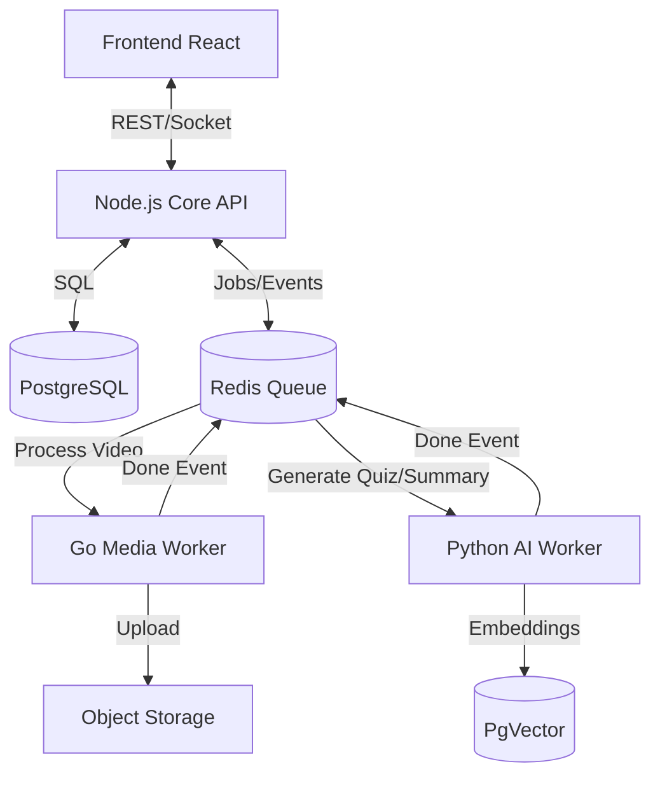

# Especificação Técnica e Roadmap - EdWise AI

Este documento serve como a fonte da verdade para a evolução da plataforma EdWise AI. Ele detalha as novas funcionalidades, a arquitetura poliglota proposta e os fluxos de dados.

## 1. Funcionalidades Detalhadas

### 1.1. Diversificação de Conteúdo (Resource Picker)
O objetivo é transformar a plataforma em um LMS completo, permitindo diversos formatos de aula.

*   **Editor de Texto Rico (Artigo Nativo):**
    *   Implementação de um editor Block-Based (estilo Notion/Medium) usando *TipTap* ou *Editor.js*.
    *   Permite imagens, vídeos, blocos de código com syntax highlighting e citações.
    *   *Benefício:* Aulas rápidas de carregar, fáceis de editar e indexáveis por IA.
*   **Embeds e Links Externos:**
    *   Componente seguro para renderizar iframes de ferramentas populares: YouTube, Vimeo, Loom, Google Slides/Forms, Figma, Typeform.
    *   *Benefício:* Centraliza o aprendizado sem obrigar o aluno a sair da plataforma.
*   **Arquivos para Download (File Repository):**
    *   Área para anexar materiais de apoio: `.zip` (projetos), `.pdf`, `.xlsx`, `.pptx`.
    *   Controle de versão simples (substituir arquivo mantém o link).
*   **I.A. Content Generator:**
    *   Botão "Magic Create": Professor digita um tópico (ex: "Ciclo de Vida do React") e a IA gera um rascunho de artigo estruturado.

### 1.2. Interatividade e Avaliação
Foco em aprendizagem ativa e retenção.

*   **Quizzes Nativos:**
    *   Tipos: Múltipla Escolha, Verdadeiro/Falso, Associação.
    *   **AI Quiz Generator:** A IA analisa o vídeo ou texto da aula anterior e gera 5 perguntas de verificação automaticamente.
*   **Tarefas (Assignments):**
    *   Fluxo completo de entrega: Professor define enunciado e prazo -> Aluno faz upload -> Professor visualiza (viewer de PDF/Imagem/Código) -> Professor dá nota e feedback.
*   **Fórum Contextual (Dúvidas):**
    *   Cada aula/módulo tem sua própria thread de discussão.
    *   *Feature Extra:* A IA sugere uma resposta preliminar para a dúvida do aluno, que o professor pode aprovar ou editar.

### 1.3. Gestão Inteligente (O Organizador)
Ferramentas para desenhar a jornada do aluno.

*   **Drip Content (Gotejamento):**
    *   Regras de liberação: "X dias após matrícula" (ideal para turmas perpétuas) ou "Data Fixa" (lançamentos).
*   **Pré-requisitos (Trilhas):**
    *   Bloqueio condicional: "Módulo Avançado" só desbloqueia se "Módulo Básico" tiver progresso > 90% ou nota no Quiz > 7.
*   **Workflow de Publicação:**
    *   Estados: `Rascunho` (só professor vê), `Agendado` (visível mas bloqueado), `Publicado` (acessível).

### 1.4. Funcionalidades Adicionais Sugeridas
*   **Gamificação (Engajamento):**
    *   Sistema de XP e Níveis baseados em aulas assistidas e tarefas entregues.
    *   Conquistas (Badges): "Maratonista" (5 aulas seguidas), "Nota 10" (Gabaritou quiz).
*   **Analytics do Professor (Retenção):**
    *   Mapa de calor de desistência nos vídeos.
    *   Lista de alunos em risco (que não acessam há X dias).

---

## 2. Arquitetura do Sistema

Adotaremos uma arquitetura orientada a serviços (Microservices-lite), utilizando a ferramenta certa para cada trabalho.

### Stack Tecnológico
*   **Frontend:** React (Vite), TailwindCSS, Lucide Icons.
*   **Backend Core:** Node.js (Express/NestJS).
*   **Media Worker:** Go (Golang).
*   **AI Worker:** Python (FastAPI/Celery).
*   **Banco de Dados:** PostgreSQL (Dados relacionais + JSONB).
*   **Cache & Mensageria:** Redis.
*   **Infra:** Docker & Docker Compose.

### Diagrama de Componentes

### Detalhamento dos Serviços

#### 1. Node.js Core (O Orquestrador)
*   **Função:** Gerencia usuários, permissões, estrutura do curso, matrículas e serve a API para o frontend.
*   **Por que Node?** Excelente para I/O, ecossistema JSON nativo, ótimo para APIs REST e WebSockets.

#### 2. Go Media Worker (O "Braço Forte")
*   **Função:** Processamento pesado de arquivos.
    *   Transcoding de vídeo (FFmpeg) para HLS (streaming adaptativo).
    *   Geração de thumbnails e sprites.
    *   Upload multipart para S3.
*   **Por que Go?** Performance próxima de C/C++, concorrência nativa (Goroutines) ideal para processar múltiplos vídeos simultaneamente sem travar a CPU.

#### 3. Python AI Worker (O "Cérebro")
*   **Função:** Inteligência e Processamento de Linguagem Natural (NLP).
    *   Transcrição de áudio (Whisper).
    *   Geração de Quizzes e Resumos (LLMs).
    *   RAG (Retrieval Augmented Generation) para o Chatbot.
*   **Por que Python?** É a língua nativa da IA. Bibliotecas como PyTorch, LangChain e drivers de LLM são de primeira classe.

#### 4. Redis (O Mensageiro)
*   **Função:** Gerenciamento de filas de tarefas (Job Queues) e Cache.
    *   Fila `media_queue`: Core envia vídeo -> Go processa.
    *   Fila `ai_queue`: Go finaliza vídeo -> Python gera transcrição.
    *   Pub/Sub: Notificar o Core quando um worker termina para avisar o usuário via WebSocket.

---

## 3. Fluxos de Dados (Data Flows)

### Fluxo A: Upload e Processamento de Aula
1.  Professor faz upload do vídeo no Frontend.
2.  **Core** cria registro `Content` (status: `processing`) e envia job para o **Redis** (`media_queue`).
3.  **Go Worker** consome o job:
    *   Valida arquivo.
    *   Converte para HLS (720p, 1080p).
    *   Extrai áudio (`.wav`).
    *   Faz upload para S3.
    *   Envia job de áudio para **Redis** (`ai_queue`).
4.  **Python Worker** consome o job de áudio:
    *   Roda Whisper para transcrever.
    *   Gera resumo e tags com LLM.
    *   Salva transcrição no Postgres.
5.  **Core** recebe evento de conclusão, atualiza status para `ready` e notifica o professor via Socket.

### Fluxo B: Geração de Quiz com IA
1.  Professor clica em "Gerar Quiz" na tela de edição.
2.  **Core** busca o conteúdo (texto ou transcrição do vídeo) e envia para **Redis** (`ai_queue`).
3.  **Python Worker**:
    *   Constrói prompt: *"Crie 5 perguntas de múltipla escolha baseadas neste texto: [transcrição]..."*
    *   Recebe JSON estruturado da LLM.
4.  **Core** recebe o JSON e cria os registros nas tabelas `quizzes` e `quiz_questions`.
5.  Frontend atualiza e mostra o quiz criado para revisão.

---

## 4. Próximos Passos (Plano de Execução)

1.  **Infraestrutura:** Configurar `docker-compose.yml` com os 3 serviços + Redis + Postgres.
2.  **Database:** Criar migrações para as novas tabelas (Assignments, Quizzes, Drip Content).
3.  **Backend Core:** Implementar endpoints para criação dos novos tipos de conteúdo.
4.  **Frontend:** Desenvolver o "Resource Picker" e os novos formulários de criação.
5.  **Workers:** Implementar o Go Worker (básico) e Python Worker (integração OpenAI).
